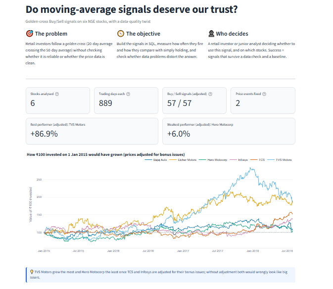
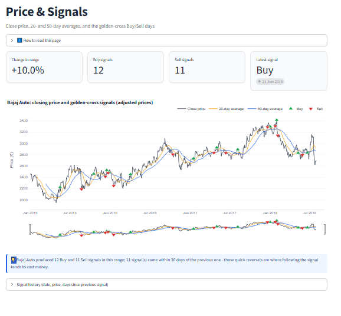
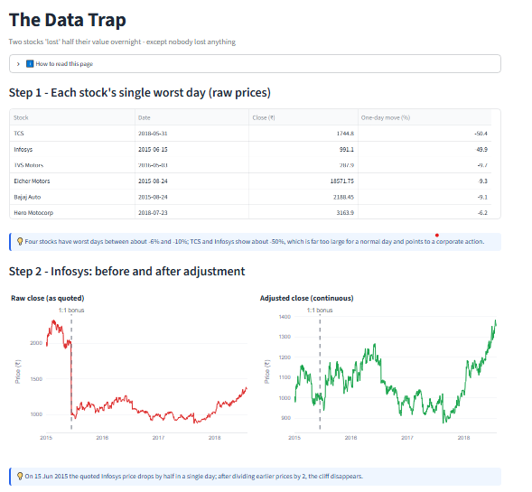
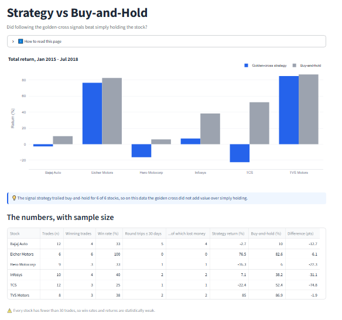
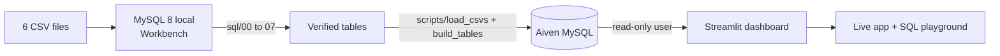

<div align="center">

# 📈 Do moving-average signals deserve our trust?

### Golden-cross Buy/Sell analysis of six NSE stocks (2015–2018) in SQL, with a data-quality twist


**[🚀 Open the live dashboard](https://nse-stock-signals-sql-dashboard-jkxkfdhnxtbrswkl6beakt.streamlit.app)**

Live app: https://nse-stock-signals-sql-dashboard-jkxkfdhnxtbrswkl6beakt.streamlit.app

</div>

<table>
<tr>
<td></td>
<td></td>
</tr>
<tr>
<td></td>
<td></td>
</tr>
</table>

---

## 🎯 Problem, objective and stakeholder

| | |
|---|---|
| **Problem** | Retail investors follow a *golden cross* (20-day average crossing the 50-day average) without checking whether the signal is reliable or whether the price data is clean. |
| **Objective** | Build the signals in SQL, measure how often they fire and how they compare with simply holding, and check whether data problems distort the answer. |
| **Stakeholder and decision** | A retail investor or junior analyst deciding whether to use a 20/50-day golden-cross signal, and on which stocks. |
| **Success measures** | Every checkpoint in the brief is reproduced (`scripts/validate_checkpoints.py`); winners and losers are reported on adjusted prices; every claim carries evidence and a caveat. |

## 🔍 Key findings

| # | Finding | Evidence |
|---|---|---|
| 1 | **Two price cliffs were not crashes.** TCS (2018-05-31) and Infosys (2015-06-15) fall about 50% in one day, consistent with 1:1 bonus issues. | Task 12: −50.4% and −49.9% one-day moves |
| 2 | **Winners and losers flip after the fix.** On raw prices TCS is −23.8% and Infosys −30.9%; adjusted, they are **+52.4%** and **+38.2%**. | Tasks 11 and 13 |
| 3 | **The cliff distorts signals.** TCS: 1 false Sell (2018-06-05). Infosys: 3 real signals hidden and 1 false Buy created. | Raw vs adjusted signal comparison |
| 4 | **Signals rarely beat holding.** On adjusted prices the golden-cross strategy trailed buy-and-hold for **all six** stocks, with only 6–12 trades each. | `sql/07_strategy_evaluation.sql` |
| 5 | **The course deck contains errors.** Its TCS and Infosys figures are wrong, and its "latest signal" for TCS changes from Sell to Buy once prices are adjusted. | Deck vs Tasks 11–13 |

<details>
<summary><b>Result tables</b></summary>

| Stock | Raw change | Adjusted change | Buys / Sells (raw) | Buys / Sells (adjusted) |
|---|---|---|---|---|
| TVS Motors | +86.9% | +86.9% | 8 / 8 | 8 / 8 |
| Eicher Motors | +82.6% | +82.6% | 6 / 7 | 6 / 7 |
| TCS | −23.8% | **+52.4%** | 12 / 13 | 12 / 12 |
| Infosys | −30.9% | **+38.2%** | 9 / 9 | 10 / 10 |
| Bajaj Auto | +10.0% | +10.0% | 12 / 11 | 12 / 11 |
| Hero Motocorp | +6.0% | +6.0% | 9 / 9 | 9 / 9 |

Across the six stocks: **56 Buys and 57 Sells** on raw prices (the brief's checkpoint), **57 and 57** on adjusted prices.

| Stock | Trades | Strategy return | Buy-and-hold |
|---|---|---|---|
| Bajaj Auto | 12 | −2.7% | +10.0% |
| Eicher Motors | 6 | +76.5% | +82.6% |
| Hero Motocorp | 9 | −16.3% | +6.0% |
| Infosys | 10 | +7.1% | +38.2% |
| TCS | 12 | −22.4% | +52.4% |
| TVS Motors | 8 | +85.0% | +86.9% |

Long-only, adjusted prices, no costs, dividends or taxes, trades at the same-day close.

</details>

## 🧭 How it fits together



## 📂 Project layout

```
sql/        00_load_data · 01_explore (tasks 1-4 + audit) · 02_moving_averages_master (5-6)
            03_signals (7-9) · 04_all_stocks (10) · 05_data_trap_and_fix (11-13)
            06_dashboard_tables (adjusted prices + signals) · 07_strategy_evaluation (extra)
scripts/    load_csvs.py · build_tables.py · validate_checkpoints.py · audit_data.py
app/        Home.py · pages/ (6 dashboard pages) · db.py · theme.py · queries.py
data/       the six source CSVs
insights/   missing_values.csv and the insights PDF
certs/      ca.pem (public Aiven CA certificate)
screenshots/  images used in this README
```

## 🖥️ Dashboard pages

| Page | What it answers |
|---|---|
| **Overview** | Problem, objective, KPIs, growth of ₹100, latest signal per stock |
| **Price & Signals** | One stock with 20/50-day averages and ▲ Buy / ▼ Sell markers |
| **Compare Stocks** | All six side by side, raw vs adjusted, signal counts |
| **Data Trap** | The two price cliffs, the fix, and which signals it changed |
| **Strategy vs Buy-and-Hold** | Did following the signals pay off? Stability across periods, trade log |
| **SQL Playground** | Run every task's query, or your own read-only `SELECT` |
| **Insights & Limits** | Claims, evidence, caveats, limitations, next steps |

## 📊 Data

Daily NSE prices for Bajaj Auto, Eicher Motors, Hero MotoCorp, Infosys, TCS and TVS Motors: 889 trading days each, 2015-01-01 to 2018-07-31, supplied with the course. Source, licence and collection method are not stated in the files. Only `close_price` is used. See [`data_dictionary.md`](data_dictionary.md).

- **Missing values:** only `deliverable_qty` and `pct_deli_qty` (1 row per stock, on 2015-12-09 or 2017-08-31). They are not used in any calculation, so the rows are kept (see `insights/missing_values.csv`).
- **Corporate actions:** TCS 1:1 bonus, ex-date 2018-05-31 (NSE circular, 30 May 2018); Infosys 1:1 bonus, ex-date 2015-06-15. Prices before each date are divided by 2.
- **Sampling:** six hand-picked large caps (4 autos, 2 IT) over 3.5 years; not representative of the market.

<details>
<summary><b>⚙️ Setup and run order</b></summary>

1. **Local MySQL 8 (Workbench).** Edit the six file paths in `sql/00_load_data.sql` and run it (needs `SET GLOBAL local_infile = 1;` and `OPT_LOCAL_INFILE=1` on the connection). Then run `01` to `07` in order. Every table is dropped and rebuilt, so the files are re-runnable.
2. **Python environment.**
   ```
   python -m venv .venv
   .venv\Scripts\activate
   pip install -r requirements.txt
   ```
3. **Database settings.** Copy `.streamlit/secrets.toml.example` to `.streamlit/secrets.toml` and fill in your host, port, user, password and database. The first line must be `[mysql]`.
4. **Load and build (optional, for a cloud database).**
   ```
   python scripts/load_csvs.py
   python scripts/build_tables.py
   python scripts/validate_checkpoints.py     # expect 13/13 PASS
   ```
   If Aiven rejects new tables without a primary key, set `mysql.sql_require_primary_key` to false in the service's advanced configuration.
5. **Run the dashboard.**
   ```
   streamlit run app/Home.py
   ```
6. **Deploy.** Push to GitHub (`secrets.toml` is git-ignored), create the app on Streamlit Community Cloud with main file `app/Home.py`, and paste the `[mysql]` block into the app's Secrets. Use a **read-only** database user for the public app.

</details>

## ⚠️ Limitations

- Six stocks and one 3.5-year window; results are associations, not causes.
- No dividends, brokerage, taxes or news; trades assumed at the same-day close.
- Corporate-action dates were first inferred from prices, then confirmed against public notices.
- Only the 20/50 window pair was tested, and each stock has just 6–12 trades.
- If new data arrives, add any new split or bonus to the `corporate_events` table and re-run `sql/06` and `sql/07`.

## 🚀 Next steps

1. Test other windows (10/30, 50/200) and hold out a period for out-of-sample checks.
2. Add transaction costs and dividends, and execute at the next day's open.
3. Automate a refresh with a check that flags any one-day move above about 30%.

## ✅ Reproducibility

The SQL was run on MySQL 8.4 (local) and on Aiven MySQL 8.4; `scripts/validate_checkpoints.py` checks 13 numbers from the brief against the database (all pass). The playground accepts a single `SELECT`/`WITH` statement and the public app uses a `SELECT`-only database user.

---

<div align="center"><sub>Not investment advice. Built as a data-analytics learning project.</sub></div>